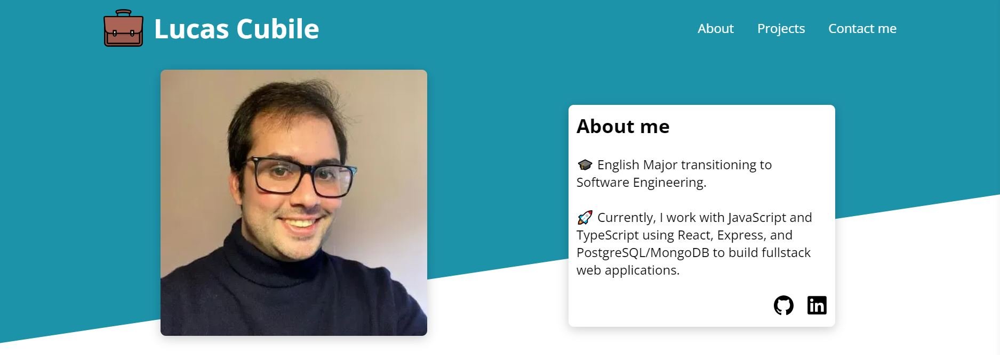
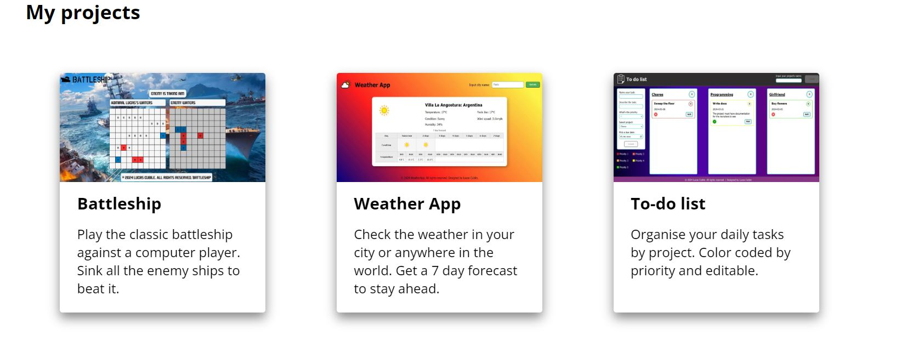
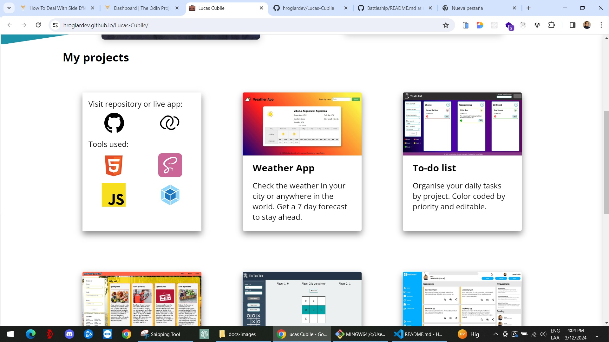
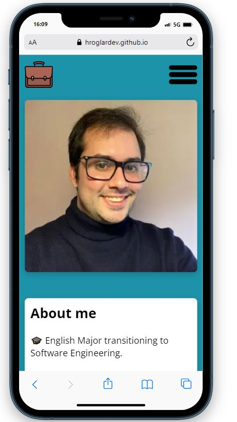

# Portfolio

A portfolio website to display all the other projects done.

# What the project is about

The project is the final project of the basics with HTML, CSS and JS. The idea was to design and develop a homepage but took the oppotunity to develop a basic portfolio to keep it updated.

As I develop more projects, I plan on adding pagination to the webpage to make it more accessible.

I also plan on updating the footer to use a contact form but this project will probably be revamped once I start with react.

# What have I learned so far?

<ul>
  <li>Animations using transitions.</li>
  <li>Animations using keyframes.</li>
  <li>Responsive menus for mobile navigations.</li>
  <li>Use of media queries to adapt layouts.</li>
</ul>

# Want to see it in action?

<a href="https://hroglardev.github.io/Lucas-Cubile/" target="_blank">Click here</a>

# How to use the app.

The app displays a navigation menu to go to specific sections. On the first view it displays some basic information about me. When the page loads, the picture and the information container perform a small animation to fade into de app.

After this section you will find a section containing my latest projects.

On hover, the cards flip and display the used technologies of the project as well as links to the repository and the deployed app.

Finally, the footer displays the contact information for me.

The app also displays a hamburger menu on mobile screens.

# Want to track my progress?

Checkout my other projects in order to see my evolution:

<ol>
  <li><a href="https://github.com/hroglardev/odin-recipes" target="_blank">Recipes</a></li>
  <li><a href="https://github.com/hroglardev/Odin-landing-page" target="_blank">Landing Page</a></li>
  <li><a href="https://github.com/hroglardev/Rock-Paper-Scissors-TOP-Console" target="_blank">Console Rock, Paper, Scissors</a></li>
  <li><a href="https://github.com/hroglardev/Rock-Paper-Scissors-TOP" target="_blank">Rock, Paper, Scissors</a></li>
  <li><a href="https://github.com/hroglardev/Etch-a-Sketch" target="_blank">Etch a Sketch</a></li>
  <li><a href="https://github.com/hroglardev/Calculator" target="_blank">Calculator</a></li>
  <li><a href="https://github.com/hroglardev/Sign-up-form-TOP" target="_blank">Sign up form</a></li>
  <li><a href="https://github.com/hroglardev/Dashboard" target="_blank">Dashboard</a></li>
  <li><a href="https://github.com/hroglardev/Library" target="_blank">Library</a></li>
  <li><a href="https://github.com/hroglardev/Tic-tac-toe" target="_blank">Tic-tac-toe</a></li>
  <li><a href="https://github.com/hroglardev/Restaurant-page" target="_blank">Restaurant page</a></li>
  <li><a href="https://github.com/hroglardev/To-do-list-js" target="_blank">To-do-list</a></li>
  <li><a href="https://github.com/hroglardev/Weather-app" target="_blank">Weather app</a></li>
  <li><a href="https://github.com/hroglardev/Battleship" target="_blank">Battleship</a></li>
  <li><a href="https://github.com/hroglardev/Lucas-Cubile" target="_blank">You are here</a></li>
</ol>
